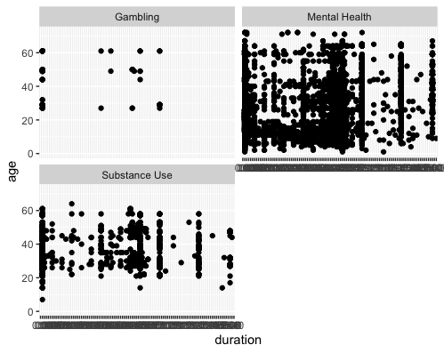
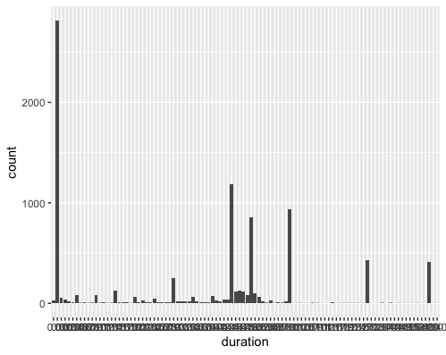
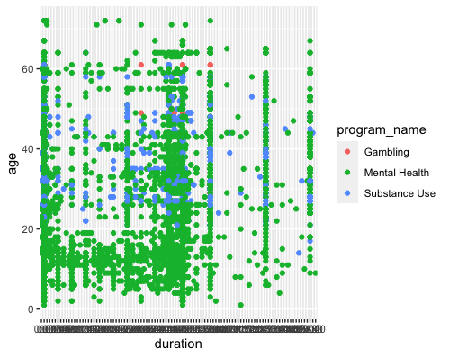

# Data Exploration


```
ggplot(data=newdata)+aes(x=duration, y=program_name)+geom_jitter()
```

-This plot shows a scatter plot of the duration of the different programs, such as Substance use, Mental health and Gambling. 




```
 ggplot(data = newdata) + 
+     geom_point(mapping = aes(x = duration, y = age)) + 
+     facet_wrap(~ program_name, nrow = 2)
```

- This is a facet plot which shows duration of the three different programs in relation to age




```
ggplot(data = newdata) + 
+     geom_bar(mapping = aes(x = duration))
```

- This is a bar chart that displays average duration of all services




```
ggplot(data = newdata) + 
+     geom_point(mapping = aes(x = duration, y = age, color = program_name))
```

- Plot 4 contains three variables, which are duration, age and program name. Each program name is represented in a different color 
