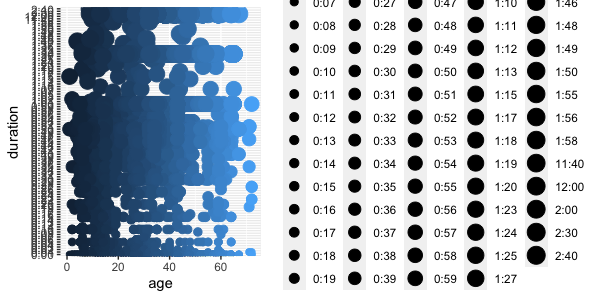

## Worst Plots

``` {r}

summary (newdata)
library (ggplot2)
ggplot(data=newdata)+geom_point(mapping=aes(x=age, y=duration, color=age, size=duration))

```





This plot is not the best one, because it is not recommneded to use size for a discrete variable, in this case, duration. Also, the column duration is not neat and needs to be reorganized nicely in order to be more visible and readable. 

``` {r}

ggplot(data = newdata) + geom_bar(mapping = aes(x = program_name), color="pink")
+facet_wrap(~program_name, nrow=2)

```


